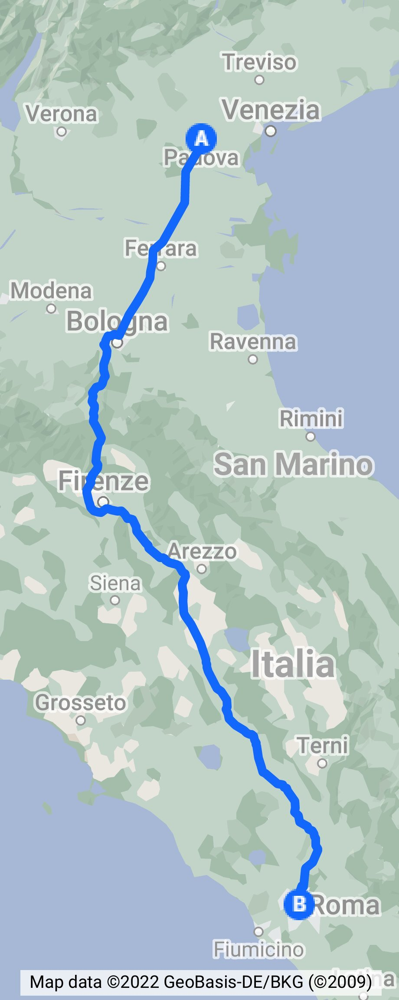
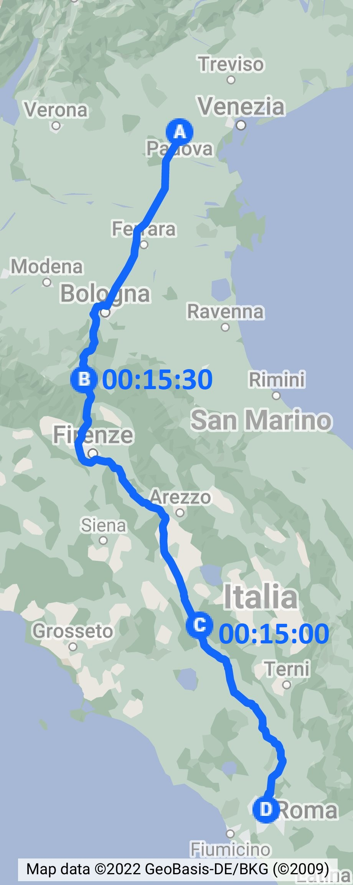

# Electric Vehicles Shortest Path Problem

This project exploits the mathematical optimization principles of mixed integer linear programming (MILP), to develop an application in Python 3.7 language capable of automating, from the characteristics of an electric vehicle as input, the search for the optimal route between two locations that includes the choice of charging stations and the respective waiting times.

The developed application aims to incentivize the use of electric vehicles, relieving the user from the complicated organization of long routes and optimizing the consumption of the vehicles' limited autonomy resources.

# Output example

  
  &nbsp;&nbsp;&nbsp;
   

# Published paper
This system has been developed as final project for my Computer Enginnering Bachelor of Science (BSc) thesis at the University of Padova. The paper describing the project's mathematical optimization background and results is available at https://hdl.handle.net/20.500.12608/31892.

## Libraries & APIs

This project exploits:
- pyomo (Python Optimization Modeling Objects, https://www.pyomo.org/), an open-source library based on the Python language that makes it possible to formulate, solve, and analyze a wide range of types of mathematical models for solving optimization problems;
- Bing Maps APIs (https://docs.microsoft.com/en-us/bingmaps/rest-services/), Microsoft services that allow retrieval, via HTTP GET requests, information regarding maps, such as locations, routes and traffic in real time. In particular, Route API and Distance Matrix APIs are used;
- Open Charge Map APIs (https://openchargemap.org/site/develop#api), services that allow retrieving, through HTTP GET requests, information regarding electric vehicle charging stations present in a territory. In particular, POI (Point Of Interest) API is used;
- Polyline (https://pypi.org/project/polyline/), Python library that implements the Encoded Polyline Algorithm Format from Google, which allows a list of geographic coordinates to be encoded into a text string;
- Requests (https://pypi.org/project/requests/), Python library that allows HTTP requests to be made.

## Usage

In order to use this application, you have to:

- Install IBM ILOG CPLEX Optimizer 20.1 (https://www.ibm.com/it-it/products/ilog-cplex-optimization-studio);
- Install the `requirements.txt` libraries;
- Edit the `input/input.json` file with the desiderd input parameters;
- Run `evspp.py`
